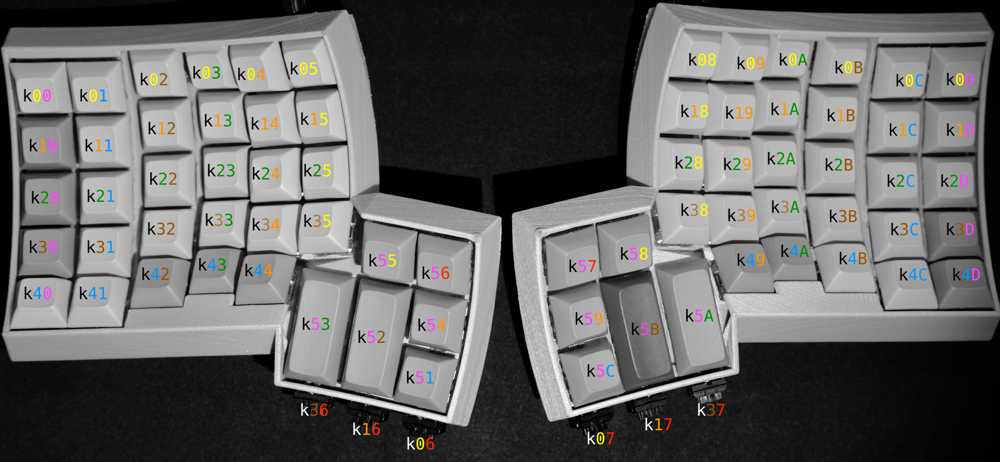

I built this keyboard following the [Dactyl QMK Guide](https://www.joedevivo.com/2017/05/20/building-a-qmk-dactyl.html) by Joe Devivo.
 This is how I have built all of my Dactyl keyboards and allows me to build the firmware
 using the ErgodoxEZ online configurator which is now branded as [oryx](https://configure.ergodox-ez.com/).
The guide can also be found directly in the [dactyl github repo](https://github.com/adereth/dactyl-keyboard/tree/master/qmk-guide).

This keyboard does not have as much room around the keys in the corners and edges so it can be challenging to solder them.
I would suggest being mindful of what your soldering iron is touching because it is very easy to lose track and start
melting the side of the case (from personal experience). You can also solder on the diode and a stretch of wire before putting
the switch in but that turned out to be more trouble than it was worth.

The most important parts of the guide are the following two images which you will refer to quite often:

I think Amoeba PCBs should fit but it is a close call. I was able to get one in the tightest corner but you have to angle it very carefully to get it over the pins.

